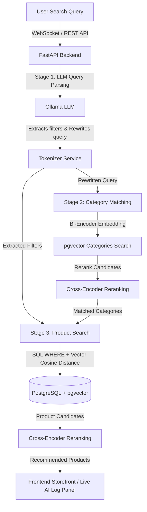

# AI-Powered E-Commerce Hybrid Search Engine

An advanced e-commerce product search system that upgrades traditional keyword searches to a semantic, natural language understanding experience using a 3-Stage Pipeline: Large Language Models (LLM), Bi-Encoder Semantic Category Retrieval, combined Vector/SQL Search, and Cross-Encoder Re-ranking.

The application features a responsive, Bootstrap-based storefront front-end with real-time pipeline log streaming via WebSockets to showcase how the system processes natural language queries step-by-step.

---

## 🏗️ System Architecture

This project is built around a hybrid, 3-stage search architecture to ensure both precision (via metadata/SQL constraints) and recall/conceptual mapping (via vector search).



### 🖼️ Architecture & Flow Diagram
*You can find the system architecture diagram below:*


### The 3-Stage Pipeline Process

1. **Stage 1: Intent Parsing & Filter Extraction (LLM)**
   - The user query (e.g., *"waterproof winter boots for baby girl in black, budget under 1000 TL"*) is processed by an LLM (Ollama - `llama3.2` by default).
   - The LLM extracts explicit filters (like `brand`, `color`, `min_price`, `max_price`) and outputs a clean, semantically expanded query optimized strictly for vector similarity (removing query noise and stopwords).

2. **Stage 2: Semantic Category Matching (Two-Stage)**
   - The system vectorizes the rewritten query using a Bi-Encoder (`sentence-transformers/all-MiniLM-L6-v2`) and finds candidate categories in PostgreSQL using cosine distance.
   - It then reranks the candidates with a Cross-Encoder (`cross-encoder/ms-marco-MiniLM-L-6-v2`) to check if any category matches exceed the confidence threshold (default 20%).

3. **Stage 3: Hybrid Retrieval & Reranking**
   - The database client resolves all subcategories recursively under the matched categories.
   - A `SQLFilterParser` converts the extracted LLM metadata filters into a dynamic SQL `WHERE` clause.
   - The backend runs a hybrid query utilizing `pgvector` (`1 - (embedding <=> query_vector) AS cosine_sim`) combined with the SQL filters.
   - The final set of product candidates is reranked via the Cross-Encoder using the expanded query and product text (`{title}. {description}`) for optimal ranking.

---

## 🧠 Vector Embedding Strategy

To optimize semantic similarity searches and category matching accuracy, the following embedding design is utilized:

### 1. Category Embedding (DeepSeek-v4 Generated Descriptions)
- **DeepSeek-v4 Integration:** Every category in the catalog contains a descriptive context/summary generated via the **DeepSeek-v4** LLM.
- **Representation:** These AI-generated category descriptions are encoded into vectors using the `sentence-transformers/all-MiniLM-L6-v2` model. This allows for rich, conceptual semantic match rates during query-to-category lookups.

### 2. Product Embedding Formula
- **Contextual Concatenation:** Products are embedded by concatenating three critical text attributes to build a robust semantic index:
  $$\text{Embedding Input} = \text{Product Title} + \text{Product Description} + \text{Category Description}$$
- **Advantage:** By combining the category's global description with the product's specific title and details, vector similarities map effectively even when users query for high-level category concepts rather than exact product names.

---

## ✨ Features

- **Natural Language Understanding:** Search for products using descriptive, conversational, and complex constraints.
- **Dynamic Metadata Extraction:** Automated filtering of color, brand, and price boundaries via LLM.
- **Hierarchical Category Resolution:** Automatically searches children categories of matched taxonomies.
- **Two-Stage Semantic Search:** Bi-Encoder for extremely fast initial retrieval and Cross-Encoder for high-accuracy reranking.
- **Real-Time Pipeline Trace:** Watch the backend pipeline execute step-by-step in the frontend's **AI Live Panel** via WebSockets.
- **Modern Bootstrap Frontend:** A sleek, fully responsive e-commerce interface including homepage catalog grid and product details page.

---

## 📁 Directory Structure

```text
.
├── api.py                         # FastAPI Web Server entry point
├── main.py                        # CLI test script for pipeline execution
├── requirements_api.txt           # Python dependency requirements
├── README.md                      # Project documentation
├── app
│   ├── api                        # FastAPI routes & lifespan
│   │   ├── main.py
│   │   ├── dependencies.py        # Dependency Injection Container
│   │   └── endpoints
│   │       ├── catalog.py         # Product & Category retrieval
│   │       └── search.py          # HTTP POST & WebSocket search routes
│   ├── core
│   │   └── config.py              # System settings & LLM system instructions
│   ├── domain
│   │   └── schemas.py             # Pydantic data schemas
│   ├── infrastructure             # External integrations
│   │   ├── db
│   │   │   └── db_client.py       # PostgreSQL database client
│   │   └── llm
│   │       └── ollama_client.py   # Ollama HTTP client
│   └── services                   # Business logic layer
│       ├── tokenizer_service.py   # Query parser & cleaner
│       ├── category_matcher_service.py # Category bi-encoder & cross-encoder matcher
│       ├── product_search_service.py   # Product vector query & reranker
│       └── sql_filter_parser.py   # Query filter metadata SQL generator
└── frontend                       # Single-Page frontend application
    ├── index.html                 # Main e-commerce page
    ├── product.html               # Product detail view page
    ├── css
    │   └── styles.css             # Page custom styles
    └── js
        ├── app.js                 # Catalog rendering & navigation logic
        ├── search.js              # WebSocket pipeline log updates
        └── product.js             # Detailed product details rendering
```

---

## 💻 Tech Stack

- **Backend:** Python, FastAPI, Uvicorn, Pydantic, WebSockets
- **Database:** PostgreSQL with `pgvector` extension, `psycopg2`
- **Machine Learning / LLM:** PyTorch, Ollama (`llama3.2`), SentenceTransformers (`all-MiniLM-L6-v2`), Cross-Encoder (`ms-marco-MiniLM-L-6-v2`)
- **Frontend:** Vanilla HTML5, Vanilla CSS3, Javascript (ES6+), Bootstrap 5, FontAwesome 6

---

## 🗄️ Database Schema

The system expects two primary tables in your PostgreSQL database with `vector` embedding columns:

### 1. `categories` Table
```sql
CREATE TABLE categories (
    id VARCHAR(255) PRIMARY KEY,
    name VARCHAR(255) NOT NULL,
    full_path TEXT,
    description TEXT,
    embedding vector(384) -- Dimension matching sentence-transformers/all-MiniLM-L6-v2
);
```

### 2. `products` Table
```sql
CREATE TABLE products (
    product_id VARCHAR(255) PRIMARY KEY,
    title TEXT NOT NULL,
    description TEXT,
    category_taxonomy TEXT,
    image_url TEXT,
    brand VARCHAR(255),
    color VARCHAR(255),
    material VARCHAR(255),
    style VARCHAR(255),
    product_type VARCHAR(255),
    model_year VARCHAR(50),
    clean_path TEXT,
    category_id VARCHAR(255) REFERENCES categories(id),
    embedding vector(384) -- Dimension matching sentence-transformers/all-MiniLM-L6-v2
);
```

---

## 🛠️ Setup & Installation

### 1. Install Prerequisites
Make sure you have the following installed on your machine:
- **Python 3.10+**
- **PostgreSQL** with the `pgvector` extension enabled.
- **Ollama** installed locally.

### 2. Pull the LLM Model via Ollama
Ensure Ollama is running and download the default model:
```bash
ollama pull llama3.2
ollama serve
```

### 3. Clone and Setup Sanity Environment
```bash
git clone <your-repository-url>
cd SDA-E-COMMERCE
```

Create a virtual environment:
```bash
python -m venv .venv
source .venv/bin/activate  # On Windows: .venv\Scripts\activate
```

Install dependencies:
```bash
pip install -r requirements_api.txt
```

### 4. Configuration & Environment Variables
The application reads database configuration from environment variables. Set them in your shell or define them in your hosting environment:

```bash
export DB_NAME="e-commerce"
export DB_USER="postgres"
export DB_PASSWORD="yourpassword"
export DB_HOST="localhost"
export DB_PORT="5432"
```

*Note: Default fallback configurations are defined in [config.py](file:///home/mehmet/Desktop/SDA-E-COMMERCE/app/core/config.py).*

---

## 🚀 Running the Application

### Running the API Server (Development)
Launch the FastAPI server with auto-reload:
```bash
python api.py
```
Or run directly via Uvicorn:
```bash
uvicorn api:app --host 0.0.0.0 --port 8000 --reload
```

Once running:
- Open your browser at **[http://localhost:8000](http://localhost:8000)** to access the storefront.
- Open **[http://localhost:8000/docs](http://localhost:8000/docs)** for interactive OpenAPI/Swagger documentation.

### Running CLI Pipeline Verification
You can test the entire pipeline in your terminal with a sample natural language query without starting the web server:
```bash
python main.py
```

---

## 🔗 API Endpoints

### 🔍 Search Endpoints
- **POST** `/api/v1/search`
  - Performs hybrid vector & metadata search synchronously.
  - *Payload example:* `{"query": "black waterproof winter boots for baby"}`
- **WebSocket** `/api/v1/ws-search`
  - Real-time pipeline search. Sends stage-by-stage diagnostics logs to the client.

### 📦 Catalog Endpoints
- **GET** `/api/v1/categories`
  - Retrieves top categories for homepage navbar and sidebar.
- **GET** `/api/v1/products/category/{category_id}`
  - Fetches products under a specific category.
- **GET** `/api/v1/products/{product_id}`
  - Fetches details of a specific product.

---

## 💻 App Interface

Here is a preview of the web storefront and interactive AI Live Panel:


---

## ⚙️ Key Configuration Options
Available configurations inside [config.py](file:///home/mehmet/Desktop/SDA-E-COMMERCE/app/core/config.py):
- `OLLAMA_MODEL_NAME` (Default: `llama3.2`)
- `EMBEDDING_MODEL_PATH` (Default: `sentence-transformers/all-MiniLM-L6-v2`)
- `CROSS_ENCODER_PATH` (Default: `cross-encoder/ms-marco-MiniLM-L-6-v2`)
- `CATEGORY_CONFIDENCE_THRESHOLD` (Default: `20.0`)
- `SYSTEM_INSTRUCTIONS` - Custom prompt to instruct the LLM on metadata extraction.

---

## 📄 License
This project does not have an active license. Please select an appropriate license before distributing.
